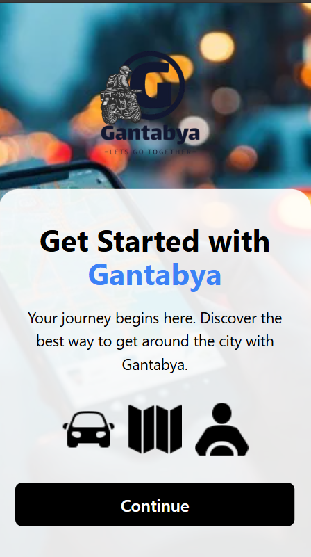

# Gantabya Ride Sharing Web Application inspired by Uber #Practice

Welcome to Gantabya, a ride-sharing web application designed to connect users with captains for a seamless and efficient transportation experience.

## Table of Contents

- Introduction
- Features
- Technologies Used
- Installation
- Usage
- Screenshots

## Introduction

Gantabya is a ride-sharing platform that allows users to book rides with captains in real-time. Whether you need a quick ride to your destination or want to explore the city, Gantabya has got you covered.

## Features

- **User Registration and Login**: Secure user authentication and registration.
- **Captain Registration and Login**: Captains can register and log in to offer their services.
- **Real-time Ride Booking**: Users can book rides and get matched with nearby captains.
- **Fare Estimation**: Get fare estimates for your rides based on pickup and destination locations.
- **Ride Tracking**: Track your ride in real-time and stay updated on your captain's location.
- **Secure Payments**: Make payments securely through the platform.

## Technologies Used

- **Frontend**: React, Tailwind CSS, GSAP, Socket.IO
- **Backend**: Node.js, Express, MongoDB, Mongoose, JWT, bcrypt
- **APIs**: OpenStreetMap, OSRM
- **Build Tools**: Vite

## Usage

1. **User Registration**: Sign up as a user to start booking rides.
2. **Captain Registration**: Sign up as a captain to offer ride services.
3. **Book a Ride**: Enter your pickup and destination locations to book a ride.
5. **Make Payments**: Pay on cash.

## Screenshots
### start page 

### User Login

### Your Trip

### New Ride available

### OTP confirm ---> Ride 

### Vehicle Options 

### User Waiting for Driver

